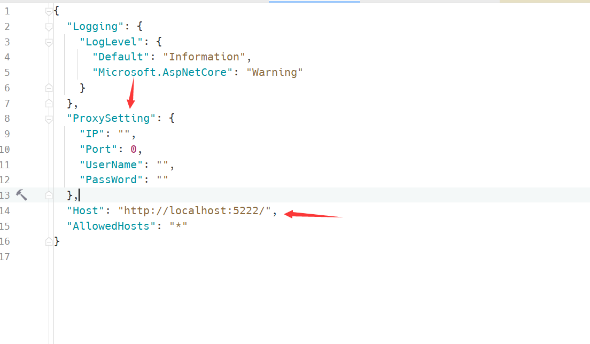

# 代理下载工具
通过代理服务器下载文件转发至国内服务器

# 文章地址
[https://wangyou233.wang/archives/92](https://wangyou233.wang/archives/92)
# 用到技术
- .Net6
- Signalr
- Jquery
- Bootstrap
- [x-ui](https://github.com/vaxilu/x-ui) 
# 在线Demo
[https://dw.wangyou233.wang/?culture=zh](https://dw.wangyou233.wang/?culture=zh)
# 配置

> 上线需配置ProxySetting和Host 2个配置项
- ProxySetting  代理服务器配置
- Host 域名地址